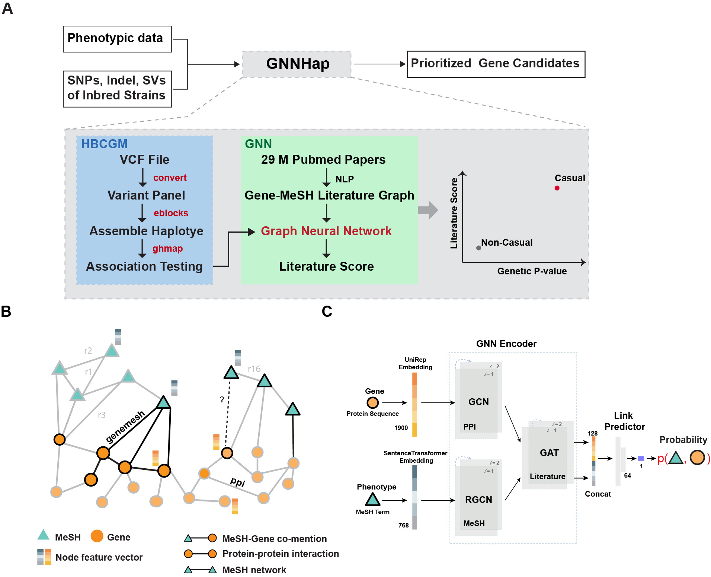

# GNNHap
Graph Neural Network based Haplotype Prioritization for inbred mouse.




## Installation
- numpy
- pandas
- Pytorch
- Pytorch Geometric
- torchmetrics
- sentencetransformers
- pubtator
- spacy
    - en_ner_bionlp13cg_md
    ```shell
    pip install https://s3-us-west-2.amazonaws.com/ai2-s2-scispacy/releases/v0.3.0/en_ner_bionlp13cg_md-0.3.0.tar.gz
    ```


## Build Graph and Train Model

if you would like to use our pretrain model, go to the prediction step

#### 1. Download files

see Download.md
#### 2. Build Knowlege graph
```shell
snakemake -s graph/pubmed_graph_parallel.smk -p -j 32
```
This step generate the graph file: human_gene_mesh_hetero_nx.gpkl

#### 3. Train your GNN and LinkPredictor
```shell
# GNN encoder + Linkpredictor
## hidden_size 50 fits to a 24G GPU card
## hidden_size 64 fits to a 32G GPU card
python GNNHap/train_gnn.py --batch_size 10000 \
                    --hidden_size 64 \
                    --num_epochs 5 \
                    --mesh_embed ${WKDIR}/human_gene_unirep.embeb.csv \
                    --gene_embed ${WKDIR}/mesh.sentencetransformer.embed.csv \
                    --gene_mesh_graph ${WKDIR}/human_gene_mesh_hetero_nx.gpkl

# optional, we won't use it in later steps
# train Link predictor only
python GNNHap/train_mlp.py --batch_size 10000 \
                    --hidden_size 64 \
                    --num_epochs 5 \
                    --mesh_embed ${WKDIR}/human_gene_unirep.embeb.csv \
                    --gene_embed ${WKDIR}/mesh.sentencetransformer.embed.csv \
                    --gene_mesh_graph ${WKDIR}/human_gene_mesh_hetero_nx.gpkl
```

## Prediction

#### 1. Simple usage
input only need a text file with at least two columns (gene_symbol, MeSH_ID)

example.txt (first two column are required):
```
GeneName        MeSH    p_val   avg_log2FC      pct.1   pct.2   p_val_adj
ITGA1   D007694 5.15054414391506e-228   2.01032118407705        1       0.108   1.2017764650997e-223
ITGAE   D007694 3.27480562769949e-160   1.89432929036404        1       0.242   7.64110397111121e-156
ACP5    D007694 5.98597006687121e-154   2.11626850602703        0.851   0.147   1.39670639570306e-149
CSF1    D007694 7.41183069402442e-146   2.14699909313243        0.744   0.102   1.72940245583672e-141
LGALS3  D007694 8.92764452941871e-123   1.6742751831308 0.818   0.182   2.08308729804927e-118

```
run prediction
```shell
python GNNHap/predict_simple.py 
            --bundle /path/to/GNNHap_Bundle 
            --input example.txt 
            --output example.gnn.txt
            --species human # or mouse
```


#### 2. Run Full GNNHap pepeline (Combined with Haplomap, or HBCGM)

see the [full guide](https://github.com/zqfang/haplomap) to get Haplomap (a.k.a HBCGM) results

An snakemake pipeline in the `example` folder shows the full commands.

```shell
snakemake -s gnnhap.smk --configfile config.yaml -j 12 -p
```

Predict

Download the [GNNHap_Bundle](https://doi.org/10.5281/zenodo.6463988), which contained necessary files

**Case 1**: single result file
```python
python GNNHap/predict.py --bundle /path/to/GNNHap_Bundle  \
                  --hbcgm_result_dir ${RESULTS}  \ # parent path to *results.txt
                  --mesh_terms D018919,D009389,D043924,D003315  \ # separate each term with comma
                  --species mouse \
                  --num_cpus 12
            
```

**Case 2**: multiple result files
**NOTE 1**: the `${HBCGM_RESULT_DIR}`  folder looks like this:
``` 
|-RESULTS
|--- MPD_000.results.txt
|--- MPD_001.results.txt
...
```

**NOTE 2**: provide a json file for `--mesh_terms` if multiple result file are predict

```python
python GNNHap/predict.py --bundle /path/to/GNNHap_Bundle  \
                  --hbcgm_result_dir ${RESULTS} \ # parent path to *results.txt
                  --mesh_terms mpd2mesh.json  \ # separate each term with comma
                  --species mouse
                  --num_cpus 12
            
```

## DataVisualization


set the `DATA_DIR` to your GNNHap output folder in the `main.py`, then run the following command:

deployment  
```
bokeh serve --show webapp --allow-websocket-origin=peltz-app-03:5006
```
