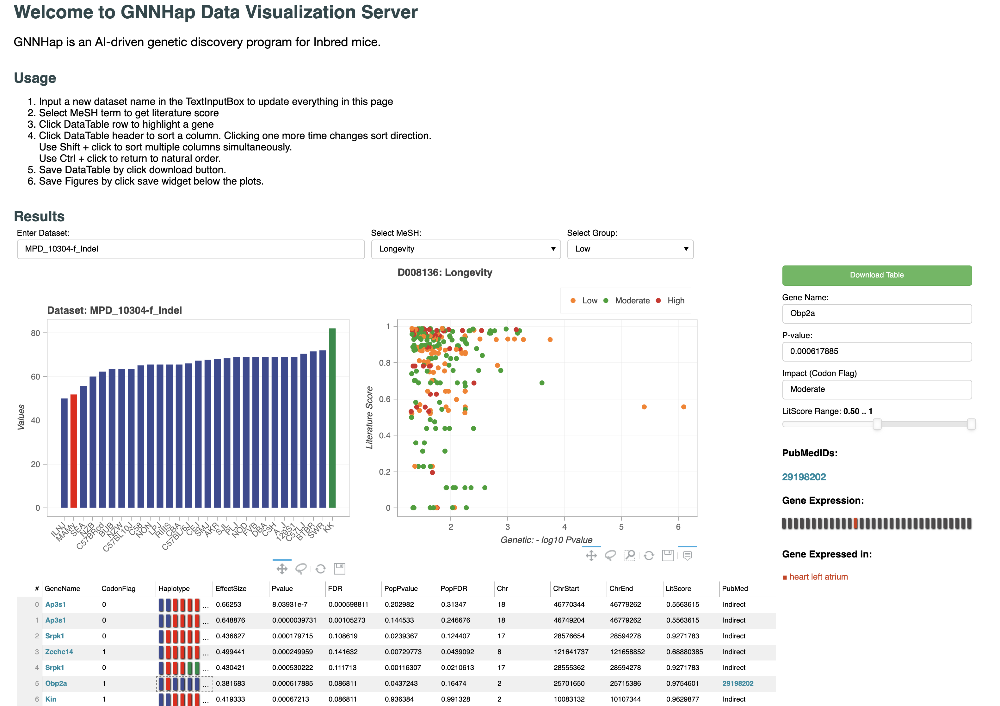

# Data visualization for GNNHap output

This is a flask+bokeh application for exploring GNNHap/HBCGM results interactively

## Installation

- flask
- bokeh
- numpy
- pandas

## Run 


**NOTE**: This app will only search files endswith "results.txt" or "results.mesh.txt".  
Modify the file path pattern if you'd like to use your own data.

Example result files could be found in the `example/PeltzData` folder.


run with command 
```shell
python app.py
```

set up correct path for all required files and programs.

you need to update 
- the `config.json` file for the web server
- the `config.yaml` for gnnhap.smk to run haplomap


## A Snapshot 


